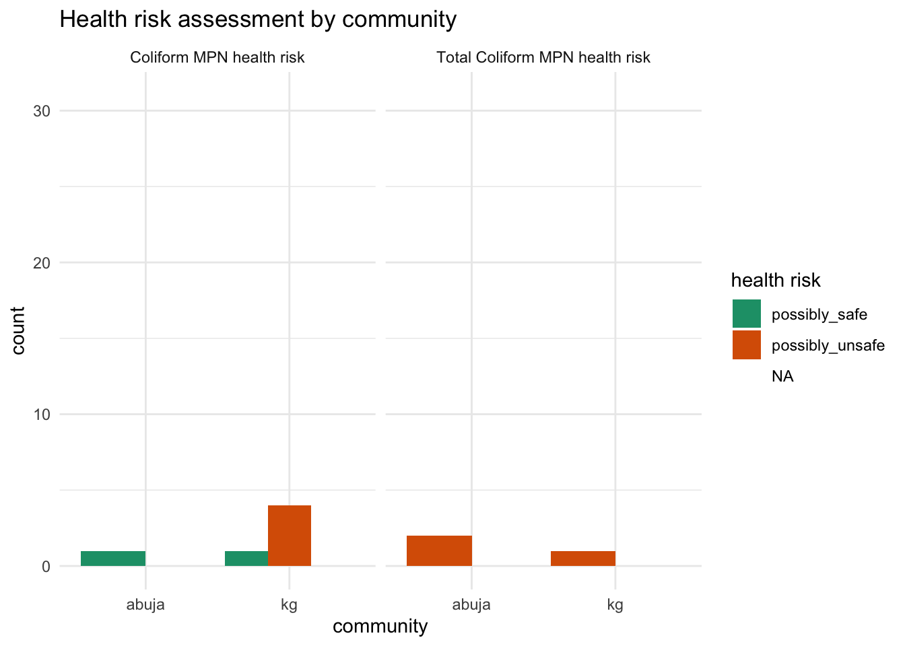

<!-- README.md is generated from README.Rmd. Please edit that file -->

# watercostaccra

<!-- badges: start -->

[](https://creativecommons.org/licenses/by/4.0/)

<!-- badges: end -->

The goal of watercostaccra is to provide users with documentation on two
surveys on household water costs, coping mechanisms as well as water
point estimates conducted in November 2023 in Accra, Ghana. The data
sets are associated with the following [project
report](https://ds4owd-001.github.io/project-efvicario/) completed by
Elizabeth Vicario for the [“data science for openwashdata”
course](https://ds4owd-001.github.io/website/) offered by
[openwashdata.org](https://openwashdata.org/).

## Installation

You can install the development version of watercostaccra from
[GitHub](https://github.com/) with:

``` r
# install.packages("devtools")
devtools::install_github("openwashdata/watercostaccra")
```

Alternatively, you can download the individual data sets as a CSV or
XLSX file from the table below.

| dataset     | CSV                                                                                                  | XLSX                                                                                                   |
|:------------|:-----------------------------------------------------------------------------------------------------|:-------------------------------------------------------------------------------------------------------|
| households  | [Download CSV](https://github.com/openwashdata/watercostaccra/raw/main/inst/extdata/households.csv)  | [Download XLSX](https://github.com/openwashdata/watercostaccra/raw/main/inst/extdata/households.xlsx)  |
| waterpoints | [Download CSV](https://github.com/openwashdata/watercostaccra/raw/main/inst/extdata/waterpoints.csv) | [Download XLSX](https://github.com/openwashdata/watercostaccra/raw/main/inst/extdata/waterpoints.xlsx) |

## Data

The package provides access to household water costs, coping mechanisms
as well as water point estimates.

``` r
library(watercostaccra)
```

The `households` data set contains data about a household survey on
water costs and coping strategies in Accra. It has 116 observations and
89 variables.

<div style="border: 1px solid #ddd; padding: 0px; overflow-y: scroll; height:400px; ">

<table class="table table-striped" style="margin-left: auto; margin-right: auto;">
<thead>
<tr>
<th style="text-align:left;position: sticky; top:0; background-color: #FFFFFF;">
variable_name
</th>
<th style="text-align:left;position: sticky; top:0; background-color: #FFFFFF;">
variable_type
</th>
<th style="text-align:left;position: sticky; top:0; background-color: #FFFFFF;">
description
</th>
</tr>
</thead>
<tbody>
<tr>
<td style="text-align:left;">
community
</td>
<td style="text-align:left;">
factor
</td>
<td style="text-align:left;">
the communities surveyed, options including \[1\] kg: Korle Gonno and
\[2\] abuja: Abuja
</td>
</tr>
<tr>
<td style="text-align:left;">
housing_type
</td>
<td style="text-align:left;">
factor
</td>
<td style="text-align:left;">
housing type, options includin \[1\] block_unit: unit in a row of
apartments made of cement blocks, \[2\] wood_unit: unit in a row of
apartments made of wood, \[3\] house, \[4\] compound_house: single-story
L- or C-shaped house with a multiple units around a shared courtyard,
\[5\] multistory_apt: multi-story apartment building, \[6\] wood_shack:
wooden shack, \[7\] no_structure, and \[8\] other
</td>
</tr>
<tr>
<td style="text-align:left;">
respondent_relationship_to_hh
</td>
<td style="text-align:left;">
factor
</td>
<td style="text-align:left;">
respondent’s relationship to the household head (respondent identified),
options including \[1\] self, \[2\] child, \[3\] spouse, and \[4\]
other_relative
</td>
</tr>
<tr>
<td style="text-align:left;">
gender
</td>
<td style="text-align:left;">
factor
</td>
<td style="text-align:left;">
gender (self-identified) of respondent, options including \[1\] female
and \[2\] male
</td>
</tr>
<tr>
<td style="text-align:left;">
tenure
</td>
<td style="text-align:left;">
factor
</td>
<td style="text-align:left;">
tenure status, options including \[1\] rented: renter, \[2\] owned:
homeowner, or \[3\] no_payment: living without payment)
</td>
</tr>
<tr>
<td style="text-align:left;">
years_in_community
</td>
<td style="text-align:left;">
integer
</td>
<td style="text-align:left;">
number of years respondent has lived in community
</td>
</tr>
<tr>
<td style="text-align:left;">
adult_count
</td>
<td style="text-align:left;">
double
</td>
<td style="text-align:left;">
number of adults in household including respondent. Household is
described as those “eating from the same pot”
</td>
</tr>
<tr>
<td style="text-align:left;">
child_count
</td>
<td style="text-align:left;">
double
</td>
<td style="text-align:left;">
number of children under 18 in household. Household is described as
those “eating from the same pot”
</td>
</tr>
<tr>
<td style="text-align:left;">
rooms_in_hh
</td>
<td style="text-align:left;">
double
</td>
<td style="text-align:left;">
number of rooms used for sleeping. Household is described as those
“eating from the same pot”
</td>
</tr>
<tr>
<td style="text-align:left;">
business_ownership
</td>
<td style="text-align:left;">
factor
</td>
<td style="text-align:left;">
household or respondent owns a business, options including \[1\]
respondent-owned and \[2\] household-owned
</td>
</tr>
<tr>
<td style="text-align:left;">
business_location
</td>
<td style="text-align:left;">
factor
</td>
<td style="text-align:left;">
location type of the business, options including \[1\] home_based, \[2\]
outside_home: fixed location outside home, or \[3\] mobile: mobile
location.
</td>
</tr>
<tr>
<td style="text-align:left;">
business_category
</td>
<td style="text-align:left;">
factor
</td>
<td style="text-align:left;">
type of business, options including \[1\] food, \[2\] shop, \[3\] salon,
\[4\] vented_water, \[5\] tailoring, and \[6\] other_services.
</td>
</tr>
<tr>
<td style="text-align:left;">
business_water_use
</td>
<td style="text-align:left;">
logical
</td>
<td style="text-align:left;">
respondent’s business uses water beyond typical needs of household (true
or false)
</td>
</tr>
<tr>
<td style="text-align:left;">
business_water_source
</td>
<td style="text-align:left;">
factor
</td>
<td style="text-align:left;">
primary source of water for business use (packaged water, piped to home,
piped to neighbor’s home, piped to compound, commercial or public tap,
borehole, dug well, spring water, delivered water)
</td>
</tr>
<tr>
<td style="text-align:left;">
primary_dw_source
</td>
<td style="text-align:left;">
factor
</td>
<td style="text-align:left;">
primary source of drinking water (packaged water, piped to home, piped
to neighbor’s home, piped to compound, commercial or public tap,
borehole, dug well, spring water, delivered water)
</td>
</tr>
<tr>
<td style="text-align:left;">
dw_reason_x
</td>
<td style="text-align:left;">
logical
</td>
<td style="text-align:left;">
columns about respondent reasons for using drinking water source on
convenience, affordability, availability, temperature, cleanliness,
taste, habit or cultural norm, trustworthiness, health, other. (true or
false)
</td>
</tr>
<tr>
<td style="text-align:left;">
package_type_preference
</td>
<td style="text-align:left;">
factor
</td>
<td style="text-align:left;">
respondent typically purchases individual, options including
\[1\]individual: sachets/packets/bottles, \[2\] bag: multipacks of
these, or \[3\] both
</td>
</tr>
<tr>
<td style="text-align:left;">
package_size_reason_x
</td>
<td style="text-align:left;">
logical
</td>
<td style="text-align:left;">
columns about reasons for purchasing preferred package type on storage
space in home, cost effectiveness, temperature at time of purchase,
availability of money, convenience, size needed for respondent or
household, avoiding wasting water by purchasing only when needed. (true
or false)
</td>
</tr>
<tr>
<td style="text-align:left;">
dw_treatment
</td>
<td style="text-align:left;">
factor
</td>
<td style="text-align:left;">
treatment methods of water before drinking, options including
\[1\]no_treatment, \[2\] boil, \[3\]boil;settle, \[4\] filter, and
\[5\]settle
</td>
</tr>
<tr>
<td style="text-align:left;">
primary_water_source
</td>
<td style="text-align:left;">
factor
</td>
<td style="text-align:left;">
primary water source for non-drinking water, options including
\[1\]packaged water, \[2\]piped_to_home, \[3\]piped to neighbor’s home,
\[4\]piped to compound, \[5\]commercial or public tap, \[6\]borehole,
\[7\]dug well, \[8\]spring water, and \[9\]delivered water)
</td>
</tr>
<tr>
<td style="text-align:left;">
primary_source_reason_x
</td>
<td style="text-align:left;">
logical
</td>
<td style="text-align:left;">
columns about reasons for using primary source of non-drinking water on
proximity to home, convenience, affordability, availability,
cleanliness, other. (true or false)
</td>
</tr>
<tr>
<td style="text-align:left;">
other_non_dw_source_use
</td>
<td style="text-align:left;">
logical
</td>
<td style="text-align:left;">
respondent uses at least one source besides primary non-drinking water
source (true or false)
</td>
</tr>
<tr>
<td style="text-align:left;">
other_non_dw_sources_x
</td>
<td style="text-align:left;">
logical
</td>
<td style="text-align:left;">
columns about additional water source(s) for non-drinking water on
packaged water, piped to home, piped to neighbor’s home, piped to
compound, commercial or public tap, borehole, dug well, spring water,
delivered water. (true or false)
</td>
</tr>
<tr>
<td style="text-align:left;">
secondary_source_reason_x
</td>
<td style="text-align:left;">
logical
</td>
<td style="text-align:left;">
columns about reason for using secondary source of non-drinking water
(primary source is not available, primary source is not clean, primary
source is crowded, availability of shower stalls, convenient location)
</td>
</tr>
<tr>
<td style="text-align:left;">
tap_payment_mode
</td>
<td style="text-align:left;">
factor
</td>
<td style="text-align:left;">
respondent’s mechanism for paying for piped water (all respondents use
piped water as a primary or secondary source). Options include \[1\]
pay_to_fetch: paying to fetch, \[2\] shares_bill: sharing or paying the
whole bill, or \[3\] both (at different taps).
</td>
</tr>
<tr>
<td style="text-align:left;">
daily_hh_water_cost_for_pay_to_fetch
</td>
<td style="text-align:left;">
double
</td>
<td style="text-align:left;">
daily estimated cost of drinking water for respondent’s household
</td>
</tr>
<tr>
<td style="text-align:left;">
daily_hh_water_cost_phhm_for_pay_to_fetch
</td>
<td style="text-align:left;">
double
</td>
<td style="text-align:left;">
daily estimated cost of drinking water for respondent’s household per
household member
</td>
</tr>
<tr>
<td style="text-align:left;">
past_struggle_to_find_water
</td>
<td style="text-align:left;">
logical
</td>
<td style="text-align:left;">
respondent has struggled to find water before (defined as extreme
difficulty in accessing water) (true or false)
</td>
</tr>
<tr>
<td style="text-align:left;">
time_of_last_struggle_to_find_water
</td>
<td style="text-align:left;">
factor
</td>
<td style="text-align:left;">
respondent’s last time of struggle to find water, options including
\[1\] last_3_days, \[2\] last_7_days, \[3\] last_30_days, \[4\]
last_year, and \[5\] over_year_ago.
</td>
</tr>
<tr>
<td style="text-align:left;">
weekdays_struggle_to_find_water
</td>
<td style="text-align:left;">
double
</td>
<td style="text-align:left;">
days in a week the respondent typically struggles to find or pay for
water
</td>
</tr>
<tr>
<td style="text-align:left;">
past_struggle_primary_reason
</td>
<td style="text-align:left;">
factor
</td>
<td style="text-align:left;">
primary reason for past struggles to find water, options including \[1\]
availability: availability, \[2\] cost, and \[3\] distance: distance to
nearest source.
</td>
</tr>
<tr>
<td style="text-align:left;">
tap_closure_knowledge_x
</td>
<td style="text-align:left;">
logical
</td>
<td style="text-align:left;">
columns about respondent’s knowledge about tap closures (usually known,
sometimes known, expected due to patterns in closures, not known, or no
answer). (true or false)
</td>
</tr>
<tr>
<td style="text-align:left;">
coping_mechanism_x
</td>
<td style="text-align:left;">
logical
</td>
<td style="text-align:left;">
columns about strategies for coping with water shortage (spending more
on the same amount of water, purchasing extra water to store at home,
using another source, using packaged water for cooking, skipping
cooking, using packaged water for bathing, skipping bathing, closing
business due to water shortage, skipping laundry). (true or false)
</td>
</tr>
<tr>
<td style="text-align:left;">
water_storage_drinking_water
</td>
<td style="text-align:left;">
logical
</td>
<td style="text-align:left;">
respondent typically stores drinking water at home (true or false)
</td>
</tr>
<tr>
<td style="text-align:left;">
water_storage_non_drinking_water
</td>
<td style="text-align:left;">
logical
</td>
<td style="text-align:left;">
respondent typically stores non-drinking water at home (true or false)
</td>
</tr>
<tr>
<td style="text-align:left;">
water_storage_none
</td>
<td style="text-align:left;">
logical
</td>
<td style="text-align:left;">
respondent typically does not store water at home (true or false)
</td>
</tr>
<tr>
<td style="text-align:left;">
storage_containers_x
</td>
<td style="text-align:left;">
logical
</td>
<td style="text-align:left;">
columns about if respondent typically stores non-drinking water, types
of storage containers (plastic jugs also called jerry cans or Kufuor
gallons, uncovered or covered barrels, other covered or uncovered
containers)
</td>
</tr>
<tr>
<td style="text-align:left;">
estimated_non_dw_storage_capacity
</td>
<td style="text-align:left;">
double
</td>
<td style="text-align:left;">
estimated capacity of storage for non-drinking water (liters)
</td>
</tr>
<tr>
<td style="text-align:left;">
estimated_stored_non_dw
</td>
<td style="text-align:left;">
double
</td>
<td style="text-align:left;">
estimated actual storage of non-drinking water (liters)
</td>
</tr>
</tbody>
</table>

</div>

The `waterpoints` data set contains data about a water point survey
conducted in Accra as well. It has 49 observations and 30 variables. For
an overview of the variable names, see the following table. observations
and 89 variables.

<div style="border: 1px solid #ddd; padding: 0px; overflow-y: scroll; height:400px; ">

<table class="table table-striped" style="margin-left: auto; margin-right: auto;">
<thead>
<tr>
<th style="text-align:left;position: sticky; top:0; background-color: #FFFFFF;">
variable_name
</th>
<th style="text-align:left;position: sticky; top:0; background-color: #FFFFFF;">
variable_type
</th>
<th style="text-align:left;position: sticky; top:0; background-color: #FFFFFF;">
description
</th>
</tr>
</thead>
<tbody>
<tr>
<td style="text-align:left;">
id
</td>
<td style="text-align:left;">
integer
</td>
<td style="text-align:left;">
identification number
</td>
</tr>
<tr>
<td style="text-align:left;">
community
</td>
<td style="text-align:left;">
factor
</td>
<td style="text-align:left;">
the communities surveyed, options including \[1\] kg: Korle Gonno and
\[2\] abuja: Abuja
</td>
</tr>
<tr>
<td style="text-align:left;">
type
</td>
<td style="text-align:left;">
factor
</td>
<td style="text-align:left;">
water point type,options including \[1\] piped_water, \[2\] borehole,
\[3\] public_bath, and \[4\] natural_spring.
</td>
</tr>
<tr>
<td style="text-align:left;">
available_services
</td>
<td style="text-align:left;">
factor
</td>
<td style="text-align:left;">
services available at water point, options including (bathing, public
sale of water, toilet, or comination of these)
</td>
</tr>
<tr>
<td style="text-align:left;">
location
</td>
<td style="text-align:left;">
factor
</td>
<td style="text-align:left;">
location of the water point, options including \[1\] within_a_compound
or \[2\] on_the_street: outside compound adjacent to street.
</td>
</tr>
<tr>
<td style="text-align:left;">
year_established
</td>
<td style="text-align:left;">
integer
</td>
<td style="text-align:left;">
year established
</td>
</tr>
<tr>
<td style="text-align:left;">
owner
</td>
<td style="text-align:left;">
factor
</td>
<td style="text-align:left;">
owner, options including \[1\] household_head, \[2\] household_member,
\[3\] community_member: community member outside household, and \[4\]
multiple_community_members: multiple community members outside household
</td>
</tr>
<tr>
<td style="text-align:left;">
constructor
</td>
<td style="text-align:left;">
factor
</td>
<td style="text-align:left;">
type of constructor, options including \[1\] government or \[2\]
community_member.
</td>
</tr>
<tr>
<td style="text-align:left;">
managers
</td>
<td style="text-align:left;">
factor
</td>
<td style="text-align:left;">
type of typical manager(s) of water point, options including household
head or member(s), employee(s), self managed by customers, or
combination of these)
</td>
</tr>
<tr>
<td style="text-align:left;">
estimated_storage_capacity_liters
</td>
<td style="text-align:left;">
double
</td>
<td style="text-align:left;">
estimated storage capacity in liters
</td>
</tr>
<tr>
<td style="text-align:left;">
average_visits_per_customer
</td>
<td style="text-align:left;">
double
</td>
<td style="text-align:left;">
average number of daily visits per customer
</td>
</tr>
<tr>
<td style="text-align:left;">
respondent_would_use_to_prepare_rice
</td>
<td style="text-align:left;">
logical
</td>
<td style="text-align:left;">
respondent would use this water to prepare rice, based on its quality
(true or false)
</td>
</tr>
<tr>
<td style="text-align:left;">
perception_of_quality
</td>
<td style="text-align:left;">
factor
</td>
<td style="text-align:left;">
respondent’s perception of water quality, options including \[1\]
acceptable, \[2\] high, and \[3\] low.
</td>
</tr>
<tr>
<td style="text-align:left;">
tap_closure_days_per_week
</td>
<td style="text-align:left;">
double
</td>
<td style="text-align:left;">
typical number of tap closures per week
</td>
</tr>
<tr>
<td style="text-align:left;">
price_25_liter_jug
</td>
<td style="text-align:left;">
double
</td>
<td style="text-align:left;">
current price of 25-liter jug of water (cedis)
</td>
</tr>
<tr>
<td style="text-align:left;">
price_20_liter_bucket
</td>
<td style="text-align:left;">
double
</td>
<td style="text-align:left;">
current price of 20-liter bucket of water (cedis)
</td>
</tr>
<tr>
<td style="text-align:left;">
price_30_liter_basin
</td>
<td style="text-align:left;">
double
</td>
<td style="text-align:left;">
current price of 30-liter basin of water (cedis)
</td>
</tr>
<tr>
<td style="text-align:left;">
avg_price_per_liter_cedis
</td>
<td style="text-align:left;">
double
</td>
<td style="text-align:left;">
average price per liter, calculated by averaging price per liter of
known prices (cedis)
</td>
</tr>
<tr>
<td style="text-align:left;">
tap_closure_changes
</td>
<td style="text-align:left;">
factor
</td>
<td style="text-align:left;">
typical dynamics of water point management during closure (increasing
prices, water point likely to close due to low storage, bathing
customers have less water than when taps are flowing)
</td>
</tr>
<tr>
<td style="text-align:left;">
flexible_pricing
</td>
<td style="text-align:left;">
logical
</td>
<td style="text-align:left;">
manager adjusts price depending on amount of water needed or familiarity
or need of customer (true or false)
</td>
</tr>
<tr>
<td style="text-align:left;">
price_increase
</td>
<td style="text-align:left;">
logical
</td>
<td style="text-align:left;">
price of any volume of water has increased in the last year (true or
false)
</td>
</tr>
<tr>
<td style="text-align:left;">
CBT_sample_source
</td>
<td style="text-align:left;">
factor
</td>
<td style="text-align:left;">
source of sample for compartment bag test (CBT) supplied by Aquagenx
(<https://www.aquagenx.com/cbt-ectc/>), options including \[1\]
indirect_from_tap\_(traveled_through_hose), \[2\]
other_storage\_(traveled_through_hose_or_poured_through_container),
\[3\] storage_tank, and \[4\] tap.
</td>
</tr>
<tr>
<td style="text-align:left;">
coli_mpn
</td>
<td style="text-align:left;">
double
</td>
<td style="text-align:left;">
results of E. Coli most probable number (MPN) test per 100 mL sample
</td>
</tr>
<tr>
<td style="text-align:left;">
coli_mpn_ci
</td>
<td style="text-align:left;">
double
</td>
<td style="text-align:left;">
results of E. Coli most probable number (MPN) test per 100 mL sample -
upper 95% confidence interval (CI)
</td>
</tr>
<tr>
<td style="text-align:left;">
coli_mpn_health_risk
</td>
<td style="text-align:left;">
factor
</td>
<td style="text-align:left;">
results of E. Coli most probable number (MPN) test per 100 mL sample -
descriptive health risk, options including \[1\]possibly_safe,
\[2\]possibly_unsafe, \[3\]probably_saf, \[4\]probably_unsafe, \[5\]
safe, \[6\]unsafe.
</td>
</tr>
<tr>
<td style="text-align:left;">
tc_mpn
</td>
<td style="text-align:left;">
double
</td>
<td style="text-align:left;">
results of Total Coliforms (TC) most probable number (MPN) test per 100
mL sample
</td>
</tr>
<tr>
<td style="text-align:left;">
tc_mpn_ci
</td>
<td style="text-align:left;">
double
</td>
<td style="text-align:left;">
results of Total Coliforms (TC) most probable number (MPN) test per 100
mL sample - upper 95% confidence interval (CI)
</td>
</tr>
<tr>
<td style="text-align:left;">
tc_mpn_health_risk
</td>
<td style="text-align:left;">
factor
</td>
<td style="text-align:left;">
results of Total Coliforms (TC) most probable number (MPN) test per 100
mL sample - descriptive health risk, options including \[1\]unsafe,
\[2\]possibly_unsafe, and \[3\]probably_unsafe.
</td>
</tr>
</tbody>
</table>

</div>

## Example

Here is an example illustrating health risks associated with the water
samples collected in Accra.

``` r
library(watercostaccra)
library(ggplot2)
library(dplyr)
library(tidyr)

long_data <- waterpoints |> 
  pivot_longer(cols = c(coli_mpn_health_risk, tc_mpn_health_risk),
               names_to = "risk_type",
               values_to = "health_risk")

# Count occurrences of each health_risk category within each community and risk_type
count_data <- long_data |> 
  group_by(community, risk_type, health_risk) |> 
  summarise(count = n(), .groups = 'drop')

facet_labels <- c(
  coli_mpn_health_risk = "Coliform MPN health risk",
  tc_mpn_health_risk = "Total Coliform MPN health risk"
)

# Create the bar plot
ggplot(count_data, aes(x = community, y = count, fill = health_risk)) +
  geom_bar(stat = "identity", position = "dodge") +
  facet_wrap(~ risk_type, labeller = labeller(risk_type = facet_labels)) +
  labs(title = "Health risk assessment by community",
       x = "community",
       y = "count",
       fill = "health risk") +
  scale_fill_brewer(palette = "Dark2") +
  theme_minimal()
```



## License

Data are available as
[CC-BY](https://github.com/openwashdata/watercostaccra/blob/main/LICENSE.md).

## Citation

Please cite this package using:

``` r
citation("watercostaccra")
#> To cite package 'watercostaccra' in publications use:
#> 
#>   Götschmann M, Vicario E, Davidson B, Amankwaa E, Zhong M (2024).
#>   "watercostaccra: Household water costs and coping strategies data
#>   from metropolitan Accra." doi:10.5281/zenodo.6470427
#>   <https://doi.org/10.5281/zenodo.6470427>,
#>   <https://github.com/openwashdata/watercostaccra>.
#> 
#> A BibTeX entry for LaTeX users is
#> 
#>   @Misc{gotschmann_etall:2024,
#>     title = {watercostaccra: Household water costs and coping strategies data from metropolitan Accra},
#>     author = {Margaux Götschmann and Elizabeth Vicario and Betty Avanu Davidson and Ebenezer F. Amankwaa and Mian Zhong},
#>     year = {2024},
#>     doi = {10.5281/zenodo.6470427},
#>     url = {https://github.com/openwashdata/watercostaccra},
#>     abstract = {A household survey on water costs and coping strategies as well as a water point survey were conducted in two low-income communities in metropolitan Accra. These are Korle Gonno, a larger, well-planned coastal area with over 35 household water vendors, and Abuja, a small, densely packed, extralegal settlement with 15 water vendor and bathhouse businesses.},
#>     keywords = {accra,ghana,household-surveys,open-data,openwashdata,r,water-cost},
#>     version = {0.0.0.9000},
#>   }
```
