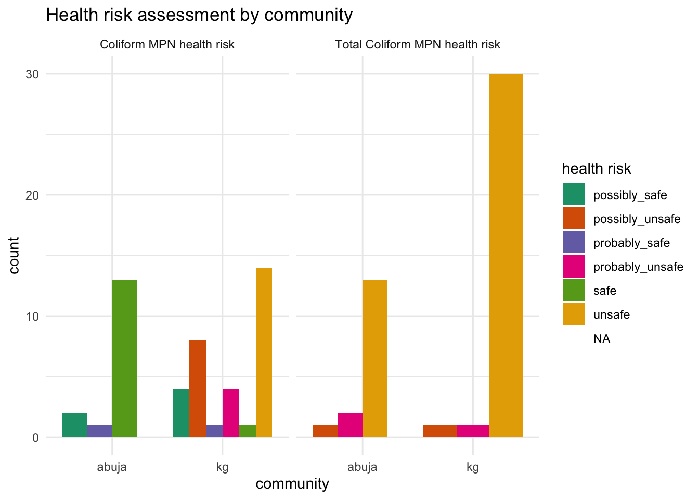

<!-- README.md is generated from README.Rmd. Please edit that file -->

# watercostaccra

<!-- badges: start -->

[](https://creativecommons.org/licenses/by/4.0/)

<!-- badges: end -->

The goal of watercostaccra is to provide users with documentation on two
surveys on household water costs, coping mechanisms as well as water
point estimates conducted in November 2023 in Accra, Ghana. The data
sets are associated with the following [project
report](https://ds4owd-001.github.io/project-efvicario/) completed by
Elizabeth Vicario for the [“data science for openwashdata”
course](https://ds4owd-001.github.io/website/) offered by
[openwashdata.org](https://openwashdata.org/).

## Installation

You can install the development version of watercostaccra from
[GitHub](https://github.com/) with:

``` r
# install.packages("devtools")
devtools::install_github("openwashdata/watercostaccra")
```

Alternatively, you can download the individual data sets as a CSV or
XLSX file from the table below.

| dataset         | CSV                                                                                                      | XLSX                                                                                                       |
|:----------------|:---------------------------------------------------------------------------------------------------------|:-----------------------------------------------------------------------------------------------------------|
| watercostaccra1 | [Download CSV](https://github.com/openwashdata/watercostaccra/raw/main/inst/extdata/watercostaccra1.csv) | [Download XLSX](https://github.com/openwashdata/watercostaccra/raw/main/inst/extdata/watercostaccra1.xlsx) |
| watercostaccra2 | [Download CSV](https://github.com/openwashdata/watercostaccra/raw/main/inst/extdata/watercostaccra2.csv) | [Download XLSX](https://github.com/openwashdata/watercostaccra/raw/main/inst/extdata/watercostaccra2.xlsx) |

## Data

The package provides access to household water costs, coping mechanisms
as well as water point estimates.

``` r
library(watercostaccra)
```

The `watercostaccra1` data set contains data about a household survey on
water costs and coping strategies in Accra. It has 116 observations and
89 variables. The `watercostaccra2` data set contains data about a water
point survey conducted in Accra as well. It has 49 observations and 30
variables. For an overview of the variable names, see the following
table.

<table class="table table-striped" style="margin-left: auto; margin-right: auto;">
<thead>
<tr>
<th style="text-align:left;">
variable_name
</th>
<th style="text-align:left;">
variable_type
</th>
<th style="text-align:left;">
description
</th>
</tr>
</thead>
<tbody>
<tr>
<td style="text-align:left;">
id
</td>
<td style="text-align:left;">
double
</td>
<td style="text-align:left;">
identification number of household
</td>
</tr>
<tr>
<td style="text-align:left;">
community
</td>
<td style="text-align:left;">
character
</td>
<td style="text-align:left;">
one of two communities surveyed (Korle Gonno or Abuja)
</td>
</tr>
<tr>
<td style="text-align:left;">
housing_type
</td>
<td style="text-align:left;">
character
</td>
<td style="text-align:left;">
housing type (block unit: unit in a row of apartments made of cement
blocks, wood unit: unit in a row of apartments made of wood, house,
compound house: single-story L- or C-shaped house with a multiple units
around a shared courtyard, multi-story apartment building, wooden shack,
no structure, other)
</td>
</tr>
<tr>
<td style="text-align:left;">
respondent_relationship_to_hh
</td>
<td style="text-align:left;">
character
</td>
<td style="text-align:left;">
respondent’s relationship to the household head (respondent identified)
</td>
</tr>
<tr>
<td style="text-align:left;">
gender
</td>
<td style="text-align:left;">
character
</td>
<td style="text-align:left;">
gender of respondent (respondent identified)
</td>
</tr>
<tr>
<td style="text-align:left;">
tenure
</td>
<td style="text-align:left;">
character
</td>
<td style="text-align:left;">
tenure status (renter, homeowner, or living without payment)
</td>
</tr>
<tr>
<td style="text-align:left;">
years_in_community
</td>
<td style="text-align:left;">
integer
</td>
<td style="text-align:left;">
number of years respondent has lived in community
</td>
</tr>
<tr>
<td style="text-align:left;">
adult_count
</td>
<td style="text-align:left;">
double
</td>
<td style="text-align:left;">
number of adults in household including respondent. Household is
described as those “eating from the same pot”
</td>
</tr>
<tr>
<td style="text-align:left;">
child_count
</td>
<td style="text-align:left;">
double
</td>
<td style="text-align:left;">
number of children under 18 in household. Household is described as
those “eating from the same pot”
</td>
</tr>
<tr>
<td style="text-align:left;">
rooms_in_hh
</td>
<td style="text-align:left;">
double
</td>
<td style="text-align:left;">
number of rooms used for sleeping. Household is described as those
“eating from the same pot”
</td>
</tr>
<tr>
<td style="text-align:left;">
business_ownership
</td>
<td style="text-align:left;">
character
</td>
<td style="text-align:left;">
household or respondent owns a business (respondent-owned or
household-owned)
</td>
</tr>
<tr>
<td style="text-align:left;">
business_location
</td>
<td style="text-align:left;">
character
</td>
<td style="text-align:left;">
home-based, fixed location outside home, or mobile location
</td>
</tr>
<tr>
<td style="text-align:left;">
business_category
</td>
<td style="text-align:left;">
character
</td>
<td style="text-align:left;">
type of business (e.g., salon, shop, water vending)
</td>
</tr>
<tr>
<td style="text-align:left;">
business_water_use
</td>
<td style="text-align:left;">
character
</td>
<td style="text-align:left;">
respondent’s business uses water beyond typical needs of household (true
or false)
</td>
</tr>
<tr>
<td style="text-align:left;">
business_water_source
</td>
<td style="text-align:left;">
character
</td>
<td style="text-align:left;">
primary source of water for business use (packaged water, piped to home,
piped to neighbor’s home, piped to compound, commercial or public tap,
borehole, dug well, spring water, delivered water)
</td>
</tr>
<tr>
<td style="text-align:left;">
primary_dw_source
</td>
<td style="text-align:left;">
character
</td>
<td style="text-align:left;">
primary source of drinking water (packaged water, piped to home, piped
to neighbor’s home, piped to compound, commercial or public tap,
borehole, dug well, spring water, delivered water)
</td>
</tr>
<tr>
<td style="text-align:left;">
dw_reason_x
</td>
<td style="text-align:left;">
character
</td>
<td style="text-align:left;">
respondent reasons for using drinking water source (convenience,
affordability, availability, temperature, cleanliness, taste, habit or
cultural norm, trustworthiness, health, other)
</td>
</tr>
<tr>
<td style="text-align:left;">
package_type_preference
</td>
<td style="text-align:left;">
character
</td>
<td style="text-align:left;">
respondent typically purchases individual sachets/bottles, multipacks of
these, or both
</td>
</tr>
<tr>
<td style="text-align:left;">
package_size_reason_x
</td>
<td style="text-align:left;">
character
</td>
<td style="text-align:left;">
reason for purchasing preferred package type (storage space in home,
cost effectiveness, temperature at time of purchase, availability of
money, convenience, size needed for respondent or household, avoiding
wasting water by purchasing when needed)
</td>
</tr>
<tr>
<td style="text-align:left;">
dw_treatment
</td>
<td style="text-align:left;">
character
</td>
<td style="text-align:left;">
treatment methods of water before drinking
</td>
</tr>
<tr>
<td style="text-align:left;">
primary_water_source
</td>
<td style="text-align:left;">
character
</td>
<td style="text-align:left;">
primary water source for non-drinking water (packaged water, piped to
home, piped to neighbor’s home, piped to compound, commercial or public
tap, borehole, dug well, spring water, delivered water)
</td>
</tr>
<tr>
<td style="text-align:left;">
primary_source_reason_x
</td>
<td style="text-align:left;">
character
</td>
<td style="text-align:left;">
reason for using primary source of non-drinking water (proximity to
home, convenience, affordability, availability, cleanliness, other)
</td>
</tr>
<tr>
<td style="text-align:left;">
other_non_dw_source_use
</td>
<td style="text-align:left;">
logical
</td>
<td style="text-align:left;">
respondent uses at least one source besides primary non-drinking water
source (true or false)
</td>
</tr>
<tr>
<td style="text-align:left;">
other_non_dw_sources_x
</td>
<td style="text-align:left;">
character
</td>
<td style="text-align:left;">
additional water source(s) for non-drinking water (packaged water, piped
to home, piped to neighbor’s home, piped to compound, commercial or
public tap, borehole, dug well, spring water, delivered water)
</td>
</tr>
<tr>
<td style="text-align:left;">
secondary_source_reason_x
</td>
<td style="text-align:left;">
character
</td>
<td style="text-align:left;">
reason for using secondary source of non-drinking water (primary source
is not available, primary source is not clean, primary source is
crowded, availability of shower stalls, convenient location)
</td>
</tr>
<tr>
<td style="text-align:left;">
tap_payment_mode
</td>
<td style="text-align:left;">
character
</td>
<td style="text-align:left;">
respondent’s mechanism for paying for piped water (all respondents use
piped water as a primary or secondary source)
</td>
</tr>
<tr>
<td style="text-align:left;">
daily_hh_water_cost_for_pay_to_fetch
</td>
<td style="text-align:left;">
double
</td>
<td style="text-align:left;">
daily estimated cost of drinking water for respondent’s household
</td>
</tr>
<tr>
<td style="text-align:left;">
daily_hh_water_cost_phhm_for_pay_to_fetch
</td>
<td style="text-align:left;">
double
</td>
<td style="text-align:left;">
daily estimated cost of drinking water for respondent’s household per
household member
</td>
</tr>
<tr>
<td style="text-align:left;">
past_struggle_to_find_water
</td>
<td style="text-align:left;">
logical
</td>
<td style="text-align:left;">
respondent has struggled to find water before (defined as extreme
difficulty to access water) (true or false)
</td>
</tr>
<tr>
<td style="text-align:left;">
time_of_last_struggle_to_find_water
</td>
<td style="text-align:left;">
character
</td>
<td style="text-align:left;">
respondent’s last time of struggle to find water (e.g., in the last
week)
</td>
</tr>
<tr>
<td style="text-align:left;">
weekdays_struggle_to_find_water
</td>
<td style="text-align:left;">
double
</td>
<td style="text-align:left;">
days in a week the respondent typically struggles to find or pay for
water
</td>
</tr>
<tr>
<td style="text-align:left;">
past_struggle_primary_reason
</td>
<td style="text-align:left;">
character
</td>
<td style="text-align:left;">
primary reason for past struggles to find water (availability, high
cost, distance to nearest source)
</td>
</tr>
<tr>
<td style="text-align:left;">
tap_closure_knowledge_x
</td>
<td style="text-align:left;">
character
</td>
<td style="text-align:left;">
respondent’s knowledge about tap closures (usually known, sometimes
known, expected due to patterns in closures, not known, or no answer)
</td>
</tr>
<tr>
<td style="text-align:left;">
coping_mechanism_x
</td>
<td style="text-align:left;">
character
</td>
<td style="text-align:left;">
strategies for coping with water shortage (spending more on the same
amount of water, purchasing extra water to store at home, using another
source, using packaged water for cooking, skipping cooking, using
packaged water for bathing, skipping bathing, closing business due to
water shortage, skipping laundry)
</td>
</tr>
<tr>
<td style="text-align:left;">
water_storage_drinking_water
</td>
<td style="text-align:left;">
logical
</td>
<td style="text-align:left;">
respondent typically stores drinking water at home (true or false)
</td>
</tr>
<tr>
<td style="text-align:left;">
water_storage_non_drinking_water
</td>
<td style="text-align:left;">
logical
</td>
<td style="text-align:left;">
respondent typically stores non-drinking water at home (true or false)
</td>
</tr>
<tr>
<td style="text-align:left;">
water_storage_none
</td>
<td style="text-align:left;">
logical
</td>
<td style="text-align:left;">
respondent typically does not store water at home (true or false)
</td>
</tr>
<tr>
<td style="text-align:left;">
storage_containers_x
</td>
<td style="text-align:left;">
character
</td>
<td style="text-align:left;">
if respondent typically stores non-drinking water, types of storage
containers (plastic jugs also called jerry cans or Kufuor gallons,
uncovered or covered barrels, other covered or uncovered containers)
</td>
</tr>
<tr>
<td style="text-align:left;">
estimated_non_dw_storage_capacity
</td>
<td style="text-align:left;">
double
</td>
<td style="text-align:left;">
estimated capacity of storage for non-drinking water in liters
</td>
</tr>
<tr>
<td style="text-align:left;">
estimated_stored_non_dw
</td>
<td style="text-align:left;">
double
</td>
<td style="text-align:left;">
estimated actual stored non-drinking water in liters
</td>
</tr>
</tbody>
</table>

## Example

Here is an example illustrating health risks associated with the water
samples collected in Accra.

``` r
library(watercostaccra)
library(ggplot2)
library(dplyr)
library(tidyr)

long_data <- watercostaccra2 |> 
  pivot_longer(cols = c(coli_mpn_health_risk, tc_mpn_health_risk),
               names_to = "risk_type",
               values_to = "health_risk")

# Count occurrences of each health_risk category within each community and risk_type
count_data <- long_data |> 
  group_by(community, risk_type, health_risk) |> 
  summarise(count = n(), .groups = 'drop')

# Create the bar plot
ggplot(count_data, aes(x = community, y = count, fill = health_risk)) +
  geom_bar(stat = "identity", position = "dodge") +
  facet_wrap(~ risk_type) +
  labs(title = "Health risk assessment by community",
       x = "community",
       y = "count",
       fill = "health risk") +
  scale_fill_brewer(palette = "Dark2") +
  theme_minimal()
```



## License

Data are available as
[CC-BY](https://github.com/openwashdata/watercostaccra/blob/main/LICENSE.md).

## Citation

Please cite this package using:

``` r
citation("watercostaccra")
#> To cite package 'watercostaccra' in publications use:
#> 
#>   Götschmann M, Vicario E, Davidson B (2024). _watercostaccra:
#>   Household water costs and coping strategies data from metropolitan
#>   Accra_. R package version 0.0.0.9000,
#>   <https://github.com/openwashdata/watercostaccra>.
#> 
#> A BibTeX entry for LaTeX users is
#> 
#>   @Manual{,
#>     title = {watercostaccra: Household water costs and coping strategies data from metropolitan Accra},
#>     author = {Margaux Götschmann and Elizabeth Vicario and Betty Davidson},
#>     year = {2024},
#>     note = {R package version 0.0.0.9000},
#>     url = {https://github.com/openwashdata/watercostaccra},
#>   }
```
